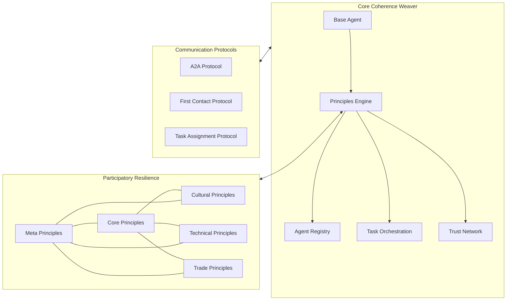
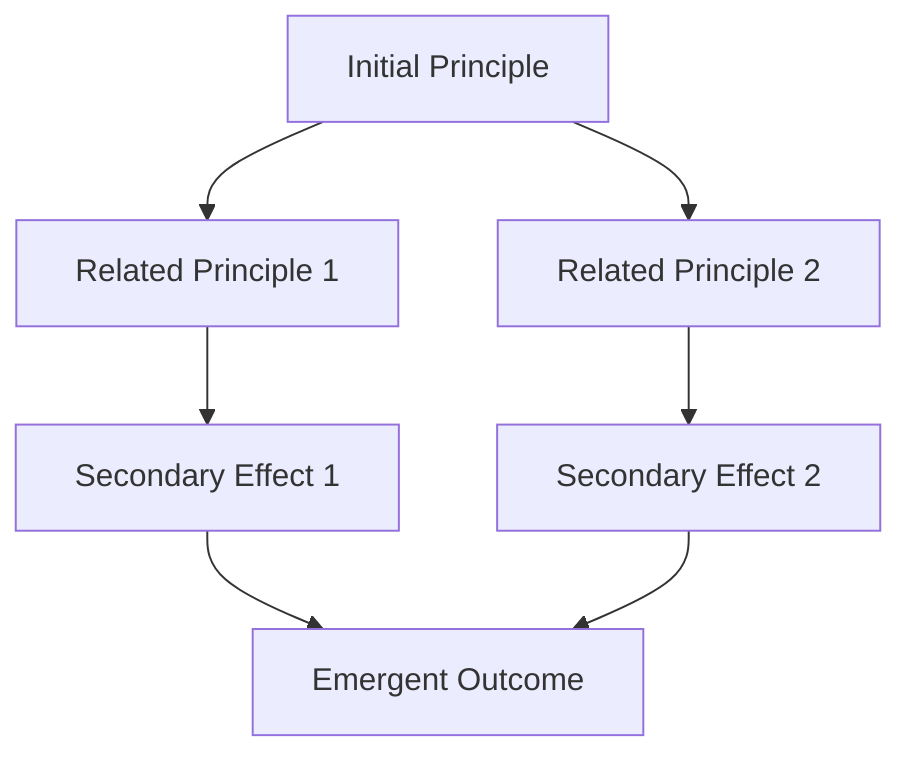
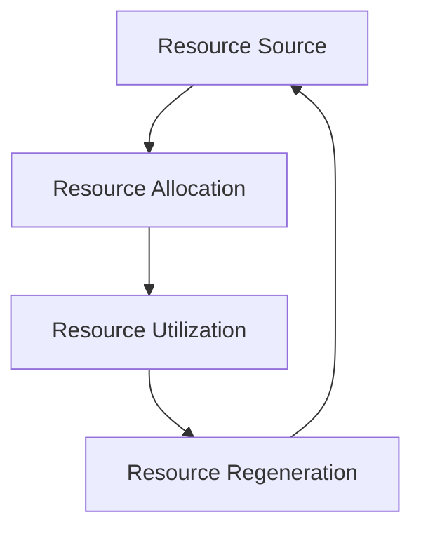
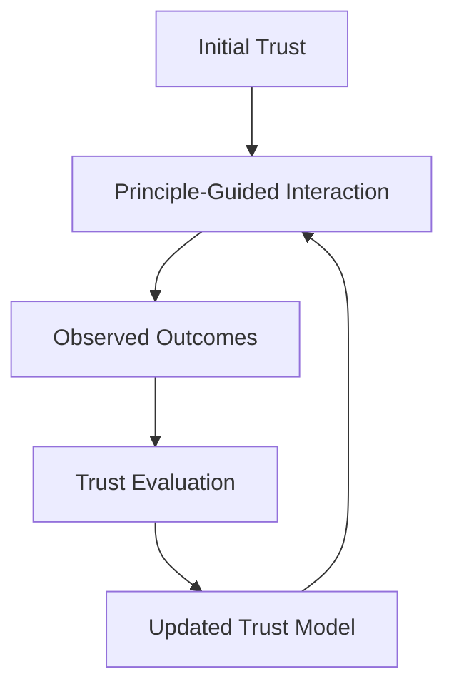
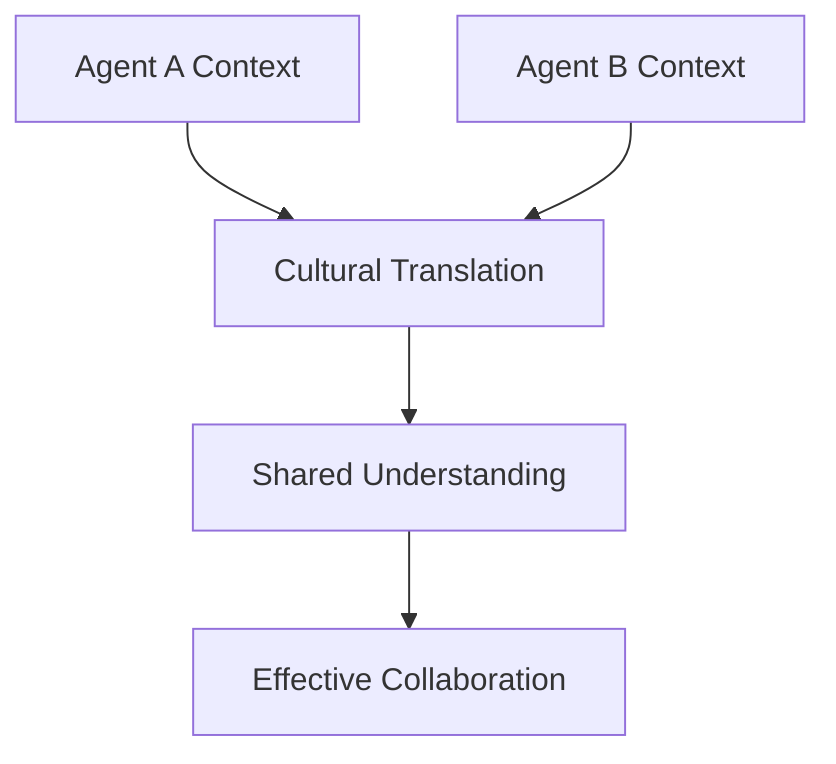

# System Patterns: Coherence Weaver with Participatory Resilience

## System Architecture

The enhanced Coherence Weaver architecture integrates participatory resilience principles into its foundation, creating a more adaptable, ethical, and distributive system:



### Key Components

1. **Principles Engine**: The new component that processes and applies participatory resilience principles to agent operations, making them a foundational element rather than an afterthought.

2. **Enhanced Agent Registry**: Now includes principle alignment assessment and support for distributed consensus models.

3. **Principle-Guided Task Orchestration**: Distributes tasks using participatory models that consider agent capabilities, loading, and ethical alignment.

4. **Regenerative Trust Network**: Trust models now incorporate meta-principles like emergent networks and principle reinforcement.

5. **A2A Protocol Extensions**: Enhanced to express principle-based considerations in agent-to-agent communication.

## Key Technical Decisions

### 1. Principle Integration Strategy: Weighted Influence vs. Hard Rules

We've chosen to implement principles as weighted influences rather than hard rules. This allows for:
- Contextual adaptation of principles
- Graceful handling of principle conflicts
- Emergent behavior from principle interactions

**Implementation Pattern**:
```python
def apply_principle_to_decision(principle_name, decision_context):
    # Retrieve principle
    principle = get_principle(principle_name)
    
    # Apply weighted influence based on domain and context
    # Rather than enforcing a rule
    updated_context = apply_weighted_influence(decision_context, principle)
    
    return updated_context
```

### 2. Domain Balance: Tripartite Consideration

All significant agent decisions consider implications across cultural, technical, and trade domains, with configurable weights based on the decision type.

**Implementation Pattern**:
```python
def make_decision(decision_context, domain_weights=None):
    # Default weights if not specified
    domain_weights = domain_weights or {
        "Culture": 0.4, 
        "Tech": 0.4, 
        "Trade": 0.2
    }
    
    # Get relevant principles from each domain
    principles_by_domain = {
        domain: get_principles_by_domain(domain)
        for domain in domain_weights.keys()
    }
    
    # Apply principles with appropriate weighting
    result = weighted_principle_application(
        decision_context, 
        principles_by_domain,
        domain_weights
    )
    
    return result
```

### 3. Meta-Principle Application: Enabling Evolution

The system implements meta-principles that allow the principle framework itself to evolve and adapt over time, creating a living system rather than a static ruleset.

**Implementation Pattern**:
```python
def apply_meta_principles(principles_set):
    # Start with our current principles
    enhanced_set = principles_set.copy()
    
    # Apply meta-principles to evolve the set
    for meta_name in META_PRINCIPLES:
        if should_apply_meta_principle(meta_name, principles_set):
            enhanced_set = apply_specific_meta_principle(
                meta_name, 
                enhanced_set
            )
    
    return enhanced_set
```

### 4. Distributed Consensus: Shared Power Implementation

For critical decisions that affect multiple agents, a distributed consensus model is used rather than centralized authority.

**Implementation Pattern**:
```python
async def reach_consensus(decision_context, participating_agents):
    # Collect perspectives from all participating agents
    perspectives = await gather_agent_perspectives(
        decision_context, 
        participating_agents
    )
    
    # Synthesize perspectives using principle-guided methods
    consensus = synthesize_perspectives(
        perspectives,
        principle_guidance=create_principle_guidance(
            "consensus_building"
        )
    )
    
    return consensus
```

## Design Patterns in Use

### 1. Principle Cascading Pattern

Principles are applied in networks that allow them to cascade and reinforce each other, creating emergent effects beyond individual principles.



### 2. Regenerative Resource Pattern

Resource allocation follows circular patterns that prioritize renewal and equitable distribution.



### 3. Trust Network Evolution Pattern

Trust relationships evolve based on principle alignment and historical interactions.



### 4. Cultural Translation Pattern

Enables agents with different designs, capabilities, and domains to effectively communicate and collaborate.



## Component Relationships

### Agent Registry & Principles Engine

The Agent Registry now considers principle alignment when matching agents for tasks, creating more effective collaborations.

### Task Orchestration & Trust Network

Task assignments integrate trust levels that are informed by principle-based evaluations of past performance.

### First Contact Protocol & Principles Engine

The First Contact Protocol now includes exchange of principle alignment information to establish baseline compatibility.

## Critical Implementation Paths

1. **Principles Module Implementation**
   - Define core principle structures
   - Implement retrieval and relationship methods
   - Create application functions

2. **Agent Class Enhancement**
   - Integrate principle consideration in decisions
   - Add principle-guided capabilities
   - Update registry with principle metadata

3. **Task Orchestration Modification**
   - Incorporate principle-based matching
   - Implement distributed decision-making for critical tasks
   - Add principle-weighted success evaluation

4. **Trust Network Evolution**
   - Enhance trust calculation with principle alignment factors
   - Implement regenerative trust patterns
   - Add meta-principle application to trust models

5. **Protocol Extensions**
   - Update A2A protocol to express principle considerations
   - Enhance First Contact with principle exchange
   - Add principle metadata to task assignments
